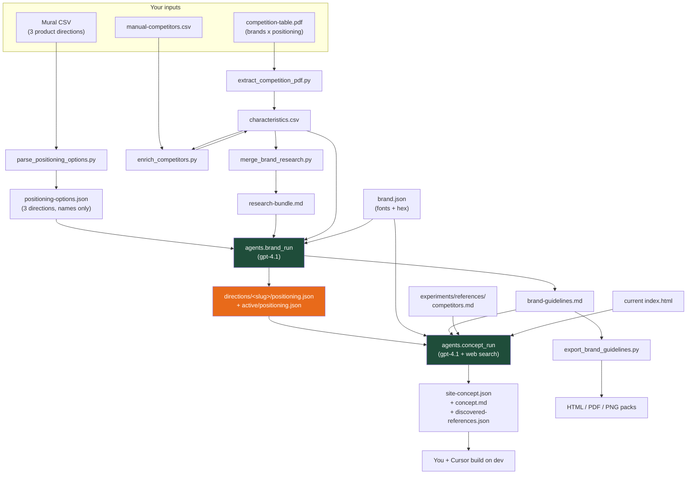
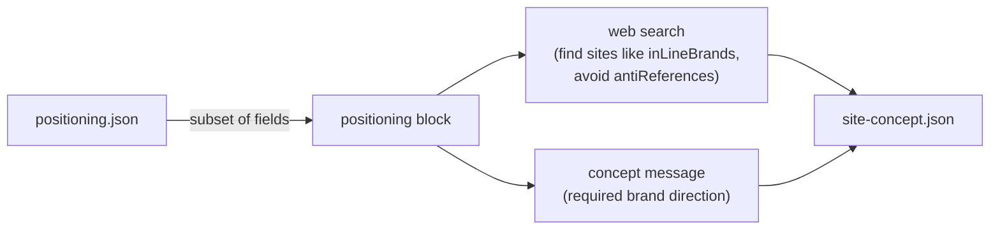
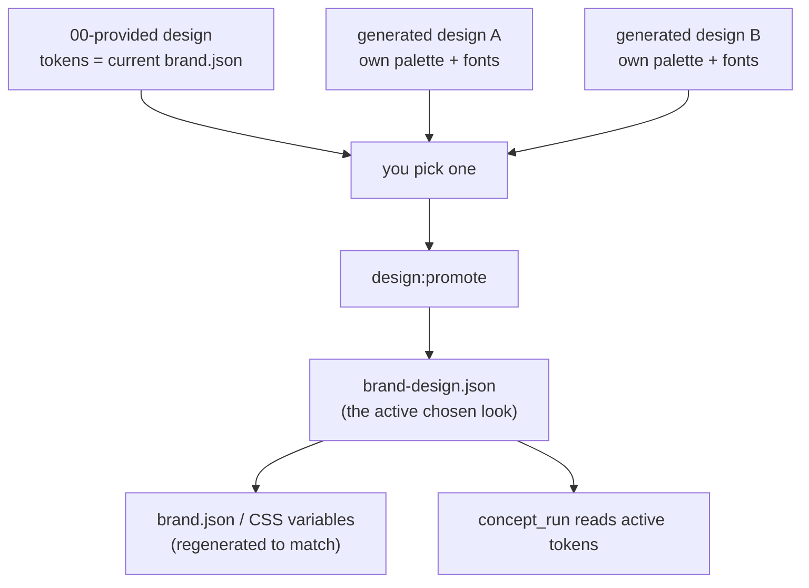
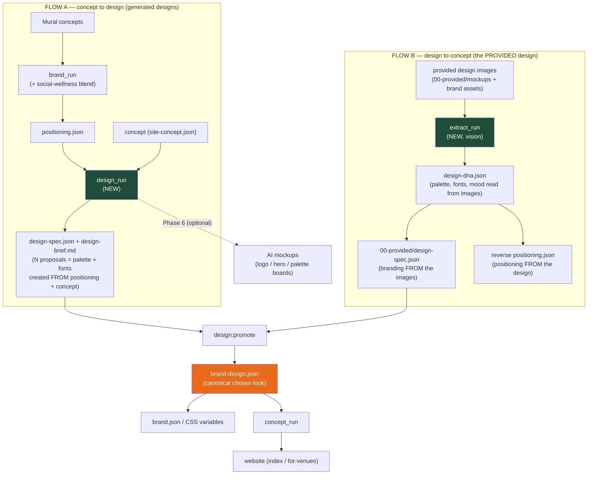

# PEP branding pipeline — overview

This is the map of how PEP branding is generated today, and the planned extension that
adds **visual design proposals** and a second entry point (start from images, not just concepts).

- **Current state:** concept side is built (`brand_run` → `concept_run`).
- **Planned:** a design-proposal stage and an image-extraction stage that converge on one
  website-ready design.

---

## 1. Current pipeline (what exists today)



### Stages

| Stage | Tool | Input | Output | Who consumes it |
|------|------|-------|--------|-----------------|
| Parse directions | `parse_positioning_options.py` | Mural CSV | `positioning-options.json` | `brand_run` |
| Extract competitors | `extract_competition_pdf.py` | competition PDF | `characteristics.csv` | `brand_run` |
| Enrich competitors | `enrich_competitors.py` | `manual-competitors.csv` | URLs + notes in CSV | `brand_run` |
| Merge research | `merge_brand_research.py` | CSV + Mural notes | `research-bundle.md` | `brand_run` |
| **Concept** | `agents.brand_run` | options + bundle + `brand.json` | `positioning.json` + `brand-guidelines.md` | `concept_run` |
| **Website concept** | `agents.concept_run` | positioning + `brand.json` + refs | `site-concept.json` + `concept.md` | you / Cursor |
| Share | `export_brand_guidelines.py` | guidelines markdown | HTML / PDF / PNG | humans |

---

## 2. How `positioning.json` is used

`positioning.json` has **one code consumer: `concept_run`**. No image script, website file, or CSS
reads it. It steers the website concept agent only.



Fields actually injected: `activeName`, `oneLiner`, `positioningStatement`,
`visual.designConcept`, `inLineBrands` (name + why), `antiReferences`.

**Implication:** positioning carries *strategy, voice, occasions, and which competitors to
emulate vs. avoid* — **not** concrete design tokens. Fonts/colors come from `brand.json`
separately. A hand-authored 4th "social-wellness" positioning works as long as it has those fields.

---

## 3. `brand.json` is now a per-design artifact (not a fixed contract)

Previously `brand.json` (Didot / Bebas / Brittany / Montserrat + greens/creams) was treated as an
immutable contract. **Correction:** those fonts/colors belong only to the **initial/provided design**.



- Each design owns its own fonts + palette in its `design-spec.json`.
- `00-provided` simply uses today's `brand.json` values as its tokens.
- Promotion writes the chosen design's tokens to `brand-design.json` and regenerates
  `brand.json` / CSS — so `brand.json` becomes **generated**, not hand-edited.
- `design_run` is allowed to invent fonts/colors (guardrails: legibility, web-font license flags).

---

## 4. Planned extension — two entry points, one output

The two flows differ in **where `brand.json` (the design tokens) comes from**:

- **Flow A (concept to design):** tokens are **created from the positioning + concept**.
- **Flow B (design to concept):** for the **already-provided design**, both the tokens **and** a
  reverse-engineered positioning are **created from the design images**.



- **Flow A** starts from a positioning (incl. the blended social-wellness) **and** the website
  concept, and generates concrete design proposals — palette + fonts invented to fit the strategy.
- **Flow B** is how the **provided design** is handled: we already have the images, so we run
  extraction over them (no competitor screenshots) to (a) write its `design-spec.json` and
  (b) **reverse-create** a positioning that matches what the design already says.
- Both produce a `design-spec.json` in the same schema, so generated proposals and the provided
  design sit side-by-side. Promotion writes the chosen one to `brand-design.json`, which
  regenerates `brand.json`/CSS and feeds `concept_run` and the website.

> **Competitors:** we keep the current `characteristics.csv` as the starting point. Adding more
> later is the existing path — drop names into `manual-competitors.csv`, run `enrich_competitors.py`,
> then `merge_brand_research.py`. No new tooling needed for that.

---

## 5. Target folder structure

```text
brand/
  brand.json                         # promoted/generated tokens (was: hand-edited contract)
  brand-design.json                  # NEW: the active chosen look (tokens + pointer)
  identity/ marketing/ product/      # UNCHANGED working asset library (site depends on these)
  designs/                           # NEW: each folder = one complete, comparable design
    00-provided/
      mockups/                       # moved from images/ + images/new/
      design-spec.json               # provided look in the shared schema
      source.md
    <timestamp>-<slug>/              # generated proposals (design_run output)
  research/
    inputs/                          # NEW: drop zone for extraction (provided images only, for now)
    extracted/<source>/design-dna.json
    directions/social-wellness/      # NEW hand-authored 4th positioning
    directions/00-provided/          # reverse positioning extracted from the provided design
```

Design concept assets live under `brand/research/design-concepts/<slug>/` (identity, marketing, product).
unreferenced `images/` and `images/new/` move into `brand/designs/00-provided/mockups/`.

---

## 6. Build phases

| Phase | Deliverable | Risk |
|------|-------------|------|
| 1 | Reorg `images/` -> `00-provided/mockups/` + `source.md` (manifest only; spec comes in Phase 3) | low (no site refs touched) |
| 2 | Hand-authored `directions/social-wellness/positioning.json` + register it | low |
| 3 | `extract_run.py` + `vision_json()` + prompt: provided images -> `design-dna.json` -> `00-provided/design-spec.json` + reverse `directions/00-provided/positioning.json` | medium |
| 4 | `design_run.py` + `design_schemas.py` + prompt: positioning + concept -> `design-spec.json` + brief (palette + fonts) | medium |
| 5 | `brand-design.json` + `design:promote` + `concept_run` reads active tokens; promotion regenerates `brand.json`/CSS | medium |
| 6 | Optional AI mockups (`generate_image`, gpt-image-1) behind `--mockups` | optional |

---

## 7. New commands (planned)

```powershell
npm run extract          # provided images -> design-dna.json + 00-provided spec + reverse positioning
npm run design           # positioning + concept -> design proposals (palette + fonts)
npm run design:promote   # pick a proposal -> brand-design.json + regenerate brand.json/CSS
```
