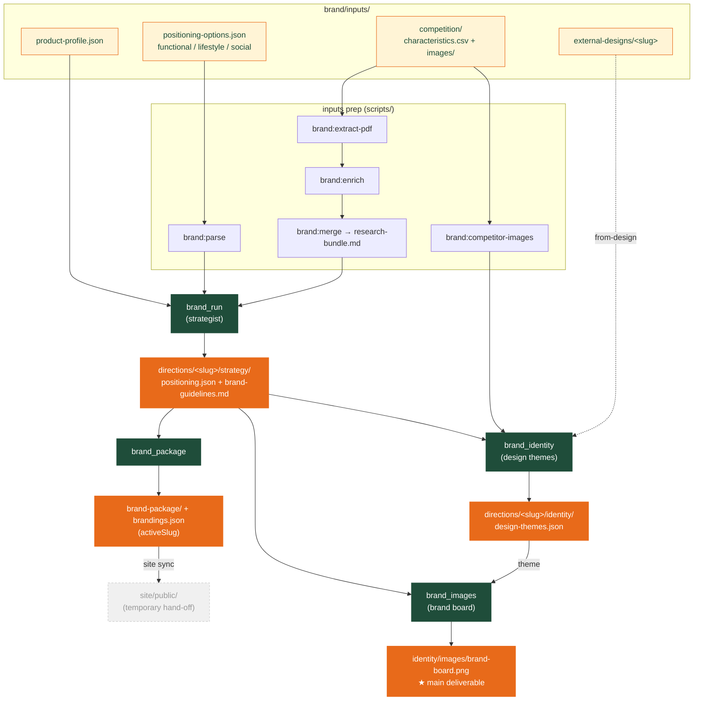

# Brand pipeline — at a glance

The one-screen visual overview. Step-by-step commands are in
**[docs/WORKFLOW.md](WORKFLOW.md)**; repo layout in **[docs/ASSETS.md](ASSETS.md)**.

Read it as: **inputs → strategist → `positioning.json` (+ guidelines)**, which then feeds
**identity → `design-themes.json`** and, together with a chosen theme, **the board →
`brand-board.png`** (the main deliverable). `brand_package` rolls the direction up into
`brandings.json`, and `site:sync` publishes approved assets to `site/public/`.

## Stages

| # | Stage | Command | Output |
|---|-------|---------|--------|
| 1 | Strategy (the strategist) | `npm run brand` | `directions/<slug>/strategy/positioning.json` + `brand-guidelines.md` |
| 2 | Design themes | `npm run brand:identity` | `directions/<slug>/identity/design-themes.json` |
| 3 | Brand board (from a theme) | `npm run brand:images` | `directions/<slug>/identity/images/brand-board.png` |
| 4 | Package | `npm run brand:package` | `directions/<slug>/brand-package/` + `brandings.json` |
| — | Publish to site | `npm run site:sync` | `site/public/` |

The **brand board is the main visual deliverable** — generated directly from the strategy + one
design theme (the image model invents the palette/type onto the board; you read them off it).

Positioning IDs: **1** `functional-protein` · **2** `lifestyle` · **3** `social`.

The strategy is **format-agnostic**: brands are grouped by *positioning fit* first
(`inLineBrands` / `positioningFitTypeMismatch` / `peerBrandsOtherPositionings`), with drink
category as secondary context — so a mocktail can be a valid **social** peer even though its
format differs from PEP.
