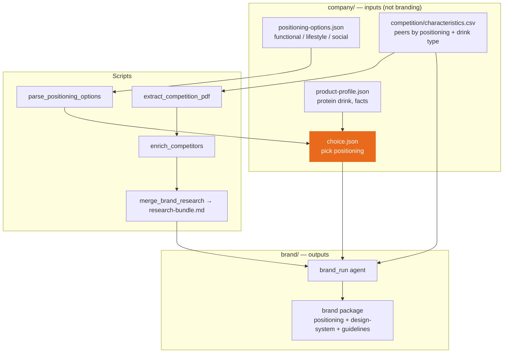

# PEP branding pipeline — concept stages

Module 1 produces a **brand package** from company inputs. Module 2 (website) comes later.

**Priority:** Flow A — **concept → design** (strategy → invented look).  
Flow B (design → concept) and exploratory `brand/design-concepts/` are **later**.



## Stages (your flow)

| Step | What | Where |
|------|------|-------|
| 1 | Product definition | `company/product-profile.json` |
| 2 | Positioning options (3 directions) | `company/positioning-options.json` |
| 3 | Competitor landscape | `company/competition/characteristics.csv` |
| 4 | **Choose positioning** | `company/choice.json` (`drinkType` optional — add later if needed) |
| 5 | Brand package | `brand/directions/<slug>/` + `brand/brand-package/` |

Step 5 should analyse how **similar competitors** brand themselves (same positioning, similar drink type), and infer customer, pricing band, visual codes — then invent a design-system (Flow A). That invention step is still the main gap in tooling.

## Brand package contents

| Part | Contents |
|------|----------|
| **Positioning** | Audience, occasions, voice, peers, anti-references |
| **Design system** | Colours, fonts, mood — **invented** for Flow A |
| **Guidelines** | Human-readable brand book |

## On disk

```text
company/
  product-profile.json
  choice.json                      # positioningSlug (drinkType optional later)
  positioning-options.json
  positioning/                     # source CSV, optional board PNG
  competition/                     # PDF source, characteristics.csv, enrichment
  research-bundle.md
  assets/                          # founders photo, etc.

brand/
  directions/<slug>/               # brand packages per positioning
  design-concepts/                 # later: Flow B exploratory designs
  active/ | brand-package/
```

## Still open

- **Drink type in choice?** Not required now — only `positioningSlug`. Add `drinkType` to `choice.json` when you want a separate filter.
- **Design invention** — `brand_run` must produce a real `design-system.json`, not empty mood-only stubs.
- **Structured competitive analysis** — optional artifact before/alongside positioning (pricing, customer, visual patterns from filtered peers).

> Script mapping: `docs/BRANDING-PIPELINE.md`
